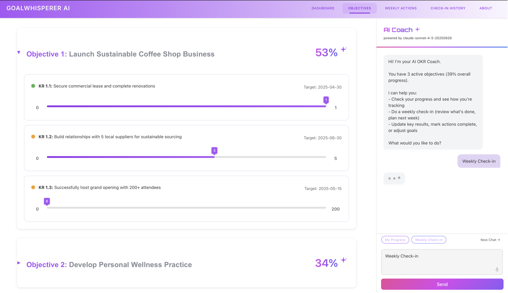

# GoalWhisperer AI

**Talk to an AI coach about your goals - out loud.** Get expert OKR guidance through natural conversation with voice-to-text. Local-first privacy, markdown-based data.



---

## 🎯 The Problem

**Achieving meaningful goals shouldn't require learning complex productivity systems.**

Traditional goal tracking fails because:
- **Writing is friction** - Updating progress in apps feels like homework, not progress
- **Systems are rigid** - OKR tools force enterprise workflows for personal goals
- **Tracking feels mechanical** - Checkboxes and forms don't capture the messy reality of goal work
- **Reflection gets skipped** - No one wants to type paragraphs about what worked and what didn't

**GoalWhisperer changes this:** Just talk. Out loud. Like you're explaining your week to a coach who actually understands OKRs. The AI listens, asks clarifying questions, updates your progress, and helps you figure out what to focus on next—all through natural conversation.

---

## ⚡ Quick Start (5 minutes)

### 1. Clone & Install
```bash
git clone https://github.com/jtloudon/goalwhisperer-ai.git
cd goalwhisperer-ai
npm run install:all
```

### 2. Choose Your Path

#### 🎯 Option A: Try Demo Data (Fastest)
Perfect for seeing what the app can do before setting up your goals.

```bash
DATA_DIR=./demo npm run dev
```

**Then open:** http://localhost:5173

You'll see a coffee shop owner's goals—completely fake data to explore features!

#### 🚀 Option B: Create Your Goals
Ready to track your own goals? Just run the app!

```bash
npm run dev
```

**Then open:** http://localhost:5173

The app will guide you through creating your first objective with an intuitive onboarding flow.

---

## 🎯 Features

### Core Tracking
- **📊 Dashboard** - Visual overview of all objectives and recent wins
- **🎯 Objectives** - Annual goals with measurable Key Results
- **📅 Weekly Actions** - Break goals into weekly action items
- **📈 Progress Tracking** - Automatic progress calculation and visualization
- **✅ Check-in History** - Reflect on what's working each week

### AI Coach (Optional)
- **💬 Conversational Interface** - Chat with Claude Sonnet 4.5 about your goals
- **🎤 Real-Time Voice Input** - Speak and watch text appear instantly (Chrome/Edge/Safari - FREE!) ✨
- **🤖 Smart Updates** - "Mark action 3 complete", "Update KR 1.2 to 75%"
- **📝 Weekly Check-ins** - Guided reflection and insights
- **🎯 Goal Creation** - Natural language objective setting

### Privacy & Data
- **🏠 Local-First** - All data stays on your machine
- **📁 Markdown Storage** - Human-readable, version control friendly
- **🔒 No Cloud Required** - Works offline (AI features need API key)
- **📤 Git-Friendly** - Track goals alongside your code

---

## 📖 How It Works

GoalWhisperer uses a simple markdown structure:

```
personal/
├── objectives/
│   └── annual-2025.md        # Your yearly goals
├── plans/
│   └── plan-2025-11-10.md   # Weekly action items
└── tracking/
    ├── completed-items.md    # What you've accomplished
    ├── checkin-history.md    # Weekly reflections
    └── progress-summary.md   # Current status
```

Example objective:
```markdown
## Objective 1: Launch My Side Business

**Description**: Build and launch a sustainable side business

**Progress**: 45%

### Key Results

#### KR 1.1: Acquire 100 customers
- **Status**: in-progress
- **Direction**: increase
- **Baseline**: 0
- **Target**: 100
- **Current**: 45
- **Progress**: 45%
- **Target Date**: 2025-12-31
```

The app parses these files and creates beautiful visualizations!

---

## 🛠️ Setup Details

### Prerequisites
- **Node.js 18+** ([download](https://nodejs.org/))
- **Anthropic API Key** (optional, for AI features) - [Get one here](https://console.anthropic.com/)

### Enable AI Coach

1. Get API key from https://console.anthropic.com/
2. Edit `backend/.env`:
   ```bash
   ANTHROPIC_API_KEY=sk-ant-your-key-here
   ```
3. Restart: `npm run dev`

### Enable Voice Input (Optional but Awesome!)

**Chrome/Edge/Safari users:** Voice input works **immediately for FREE!** Just click 🎤 and start talking - text appears in real-time! No setup needed. ✨

**Firefox users only:** Want voice input too? Add OpenAI API key for Whisper fallback:

1. Get OpenAI API key from https://platform.openai.com/
2. Add to `backend/.env`:
   ```bash
   OPENAI_API_KEY=sk-your-openai-key-here
   ```
3. Restart: `npm run dev`
4. Click the 🎤 microphone button in the chat interface!

**📖 Full setup guide:** See [VOICE_FEATURE.md](docs/voice-feature.md) for details, troubleshooting, and cost info.

### Validate Your Data

Check if your markdown files are formatted correctly:

```bash
npm run validate
```

This will show errors like:
- Missing required fields
- Invalid date formats
- Non-numeric target values
- Structural issues

---

## 💡 What the AI Coach Does For You

The AI coach actively guides you through the OKR process—no manual expertise required.

### Refines Vague Goals Into Clear Objectives
Turns "do business stuff" → "Launch sustainable coffee shop business with measurable milestones"

### Ensures Everything is Measurable
Catches "get some customers" → Suggests "Acquire 100 customers by Dec 31" with baseline and target

### Keeps You Focused on What Matters
- Guides weekly planning to 3-5 high-impact actions
- Maps each action to specific Key Results
- Prevents overcommitment and scope creep

### Provides Proactive Insights
- Flags stalled progress and at-risk objectives
- Celebrates wins and completed Key Results
- Suggests adjustments based on your check-in history
- Asks clarifying questions to deepen your strategy

### Example Interactions
- "Let's do my weekly check-in" → Guided reflection with structured prompts
- "What should I focus on this week?" → AI analyzes your objectives and suggests priorities
- "Mark action 2 complete" → Updates progress and asks about blockers or wins

---

## 🏗️ Tech Stack

- **Frontend:** React 18 + Vite + React Router
- **Backend:** Node.js + Express
- **AI:** Claude Sonnet 4.5 (Anthropic)
- **Data:** Markdown files (no database!)
- **Styling:** Vanilla CSS with gradient accents

**📐 System Design:** See [Architecture & Design](docs/architecture.md) for detailed system architecture, design decisions, and data flow diagrams.

---

## 📦 Project Structure

```
goalwhisperer-ai/
├── frontend/              # React application
│   ├── src/
│   │   ├── components/    # UI components (ClaudePanel, WinsTrendline, etc.)
│   │   ├── pages/         # Route pages (Dashboard, Objectives, Plans)
│   │   └── App.jsx
├── backend/               # API server
│   ├── src/
│   │   ├── config/        # Configuration (data paths)
│   │   ├── routes/        # API endpoints
│   │   ├── services/      # Parser, AI logic, file writers
│   │   └── server.js
├── demo/                  # Sample data (coffee shop owner)
│   ├── objectives/
│   ├── plans/
│   └── tracking/
├── demo-new-user/         # Empty state for testing
├── docs/                  # Documentation (voice feature, markdown guide, API)
├── scripts/               # Validation tools
└── personal/              # YOUR data (gitignored)
```

---

## 🚀 Development

### Available Scripts

```bash
npm run dev              # Start both frontend & backend
npm run dev:frontend     # Frontend only (port 5173)
npm run dev:backend      # Backend only (port 3001)
npm run build            # Build for production
npm run validate         # Check markdown data
```

### Running with Different Data

```bash
# Use demo data
DATA_DIR=./demo npm run dev

# Use personal data (default)
npm run dev

# Use custom location
DATA_DIR=/path/to/data npm run dev
```

---

## 🤝 Contributing

This is a personal portfolio project, but I welcome:
- 🐛 Bug reports
- 💡 Feature suggestions
- 📝 Documentation improvements

Please open an issue to discuss!

---

## 📄 License

MIT License - Feel free to use this for your own goals!

---

## 👤 Author

**Jesse Loudon**
AI, Analytics & Business Insights

This project demonstrates full-stack development with AI integration, applying professional experience in:
- **Systematic goal management** (OKR methodology used in transformation initiatives)
- **LLM integration patterns** (conversational interfaces, structured data updates, prompt engineering)
- **User-centric design** (progressive enhancement, privacy-first architecture)

[GitHub Profile](https://github.com/jtloudon) | [More Projects](https://github.com/jtloudon?tab=repositories)

---

## 📚 Additional Resources

- **Demo Data:** See `demo/` folder for examples
- **Data Format:** Check `demo/objectives/annual-2025.md` for template
- **Troubleshooting:** Run `npm run validate` to check data

---

*Made with ❤️ and Claude Sonnet 4.5*
